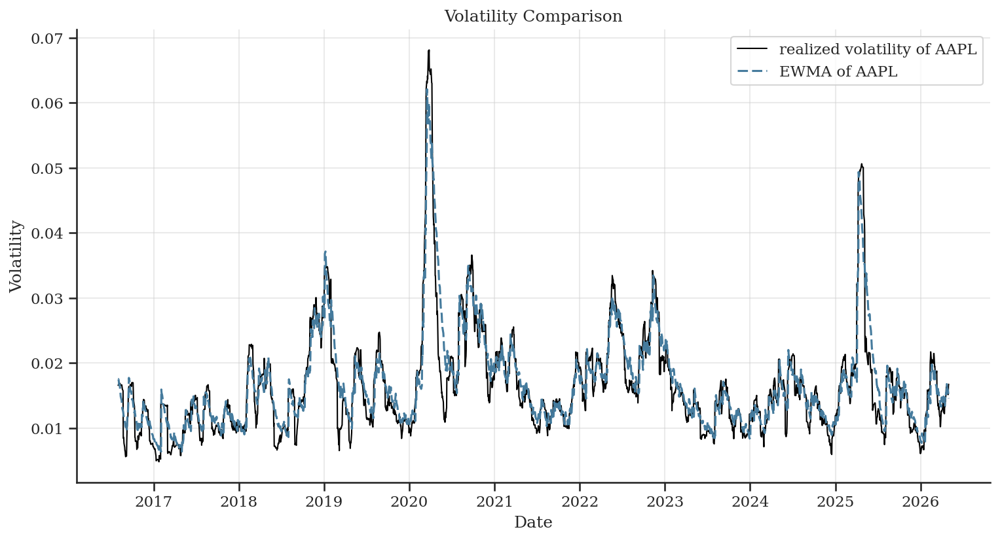

Portfolio Risk Evaluation: Volatility Forecasting and VaR Backtesting

Overview

This project evaluates volatility forecasting models and their impact on Value-at-Risk (VaR) estimation and backtesting.

The objective is to assess whether more complex models (GARCH) provide tangible benefits over simpler approaches (EWMA, rolling volatility) in a realistic out-of-sample setting.

Three models are compared:

* Rolling volatility (historical standard deviation)
* EWMA (Exponentially Weighted Moving Average)
* GARCH(1,1)

All models are evaluated under the same rolling-window framework.

⸻

Key Idea

Volatility forecasting is a key risk factor but:

* better volatility forecasts do not necessarily translate into better risk measures
* model complexity does not guarantee improved performance
* VaR calibration is sensitive to distributional assumptions

This project explicitly separates:

* forecast accuracy
* risk calibration

⸻

Methodology

* Data: daily log returns from 20 US large-cap equities
* Horizon: 10 years
* Rolling window: 60 days (short window to evaluate how different models react to noisy inputs)
* Forecast horizon: 1-day ahead
* proxy of realized volatility 20 days as benchmark. common in lecterature

Volatility Models:

* Rolling: standard deviation on the training window
* EWMA: exponential weighting with decay parameter λ 
* GARCH(1,1): fitted at each step on rolling window

Evaluation:

1. Forecast accuracy
    * MAE
    * RMSE
    * QLIKE
2. VaR estimation
    * VaR computed as left-tail quantile of returns
    * Cornish-Fisher expansion used to account for skewness and kurtosis
3. VaR backtesting
    * Violation rate
    * Kupiec test (coverage)
    * Christoffersen test (independence)

⸻

Results

Volatility Forecasting:

* EWMA achieves the lowest MAE, RMSE, and QLIKE across assets
* GARCH does not outperform simpler models
* Rolling volatility is the least accurate estimator

VaR Backtesting:

* All models produce violation rates above the nominal level (5%)
* This indicates systematic underestimation of tail risk
* Rolling volatility shows slightly better coverage, but remains miscalibrated

Key Insight:

* Better volatility forecasts do not imply better VaR calibration
* Model simplicity (EWMA) provides robust forecasts
* However, none of the models delivers correctly calibrated risk measures

⸻

Limitations

* Higher moments (skewness, kurtosis) are estimated over the full sample (static)
* VaR is based on parametric assumptions (Cornish-Fisher expansion)
* GARCH is refitted at each step, increasing estimation noise
* No modeling of extreme tails (e.g. EVT)
* Christoffersen test is inconclusive due to insufficient transition observations

⸻

Takeaway

* EWMA is the most reliable model for volatility forecasting in this setting
* All models systematically underestimate tail risk

⸻

Tech Stack

* Python
* pandas, numpy
* arch (GARCH models)
* scipy (statistical tests)
* scikit-learn (metrics)
* matplotlib / seaborn

⸻

Structure

* src/ → core modules (data, test, volatility, forecast, metrics, VaR, backtest, sanity_check, plot)
* results/ → saved outputs (forecast, hits, kupiec, plots, returns, stats, VaR, violation rate)
* notebooks/ → analysis and visualization
* main.py → full pipeline